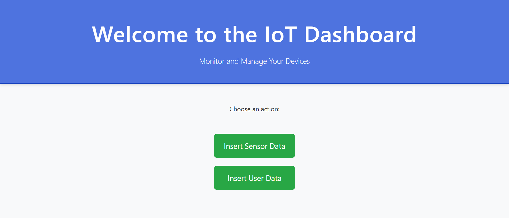
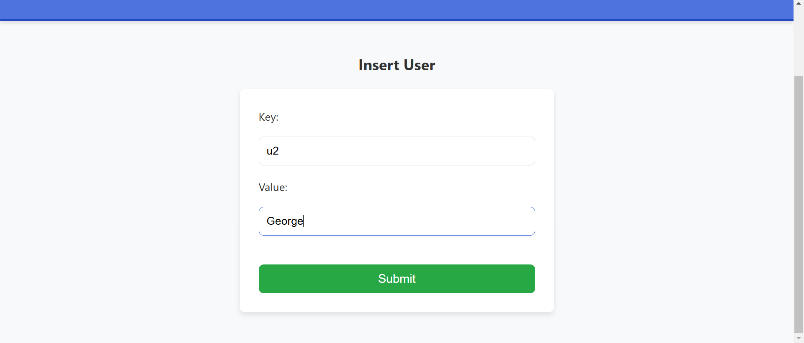
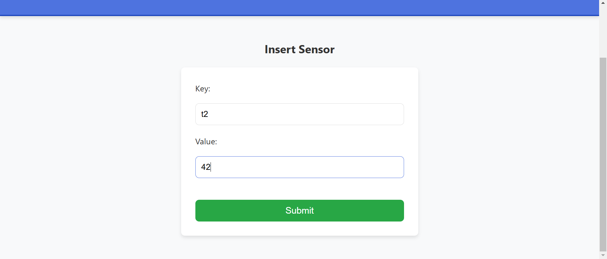
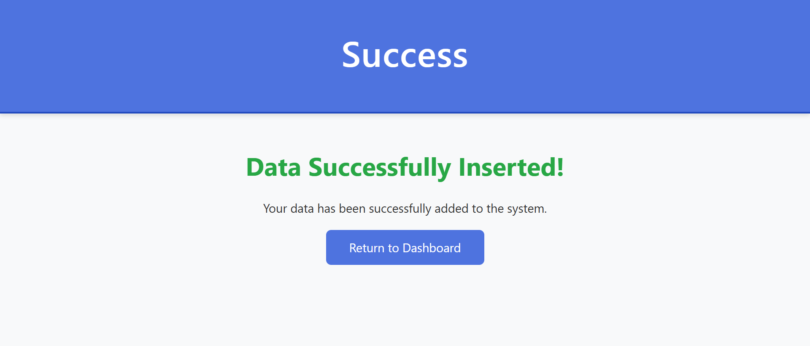
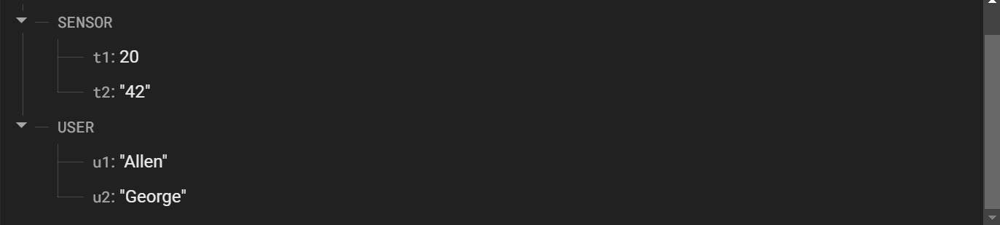

# IoT Course Assignment

This is a project created to familiarize with Django, Firebase, and web development concepts. The application provides basic functionality for inserting sensor data and user details into a Firebase Realtime Database. It allows users to input data through forms and view success pages upon successful insertion.

## Features

- **Home Page**: Displays the landing page of the application.
- **Insert User Data**: Allows users to insert user data (key-value pairs) into Firebase.
- **Insert Sensor Data**: Allows users to insert sensor data (key-value pairs) into the Firebase Realtime Database.
- **Success Page**: Displays a success message upon successful insertion of data.
- **Firebase Integration**: Uses Firebase Realtime Database to store and retrieve data. 

## Technologies Used

- **Backend**: Django, Firebase Admin SDK  
- **Frontend**: HTML/CSS
- **Database**: Firebase Realtime Database  

## Installation and Setup

### Prerequisites
Ensure you have Python and Pipenv installed on your system.

### Steps to Set Up the Project

1. **Clone the repository**  
   ```sh
   git clone https://github.com/paulallen0830/iot-course-assignment.git
   cd iot-course-assignment
   ```

2. **Set up a virtual environment**  
   ```sh
   pipenv install
   pipenv shell
   ```

3. **Install dependencies**  
   ```sh
   pipenv install django firebase-admin
   ```

4. **Configure Firebase**  
   - Download the Firebase Admin SDK JSON file from the Firebase console.  
   - Place it inside the project folder and update `views.py` with the correct file path.  

5. **Run the Django server**  
   ```sh
   python manage.py runserver
   ```

6. **Access the application**  
   Open a web browser and go to: [http://127.0.0.1:8000](http://127.0.0.1:8000)

## Screenshots

### Dashboard


### Insert User


### Insert Sensor


### Success


### Firebase Database

